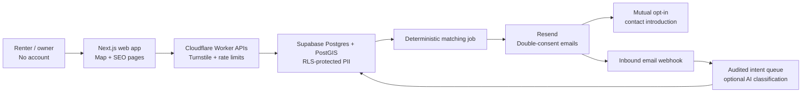

# Hyderabad.Rent — zero-brokerage MVP to 200k monthly visitors

## Summary

Build `hyderabad.rent` as a mobile-first, no-account rental marketplace for verified flats and flatmate rooms. It will launch city-wide, seed the Gachibowli–Madhapur–Kondapur–Financial District corridor first, and reveal contact details only after both people opt in.

Recent local demand strongly supports the initial filters: furnished status, monthly budget, move-in timing, amenities, food/smoking preferences, and office-commute locality. [Recent Hyderabad rental discussions](https://www.reddit.com/r/HyderabadRentals/comments/1upshsq/need_a_room_in_a_preoccupied_flat_male/) also reinforce that flatmate matching is a core, not secondary, feature.

## Architecture and public interfaces

- Start a TypeScript modular monolith: Next.js App Router, deployed through Cloudflare Workers; Supabase Postgres/PostGIS for data; MapLibre GL with a replaceable map-tile/geocoder provider; Resend for outbound and inbound email. This is inexpensive at launch and keeps every future service boundary explicit.

- Use Resend webhooks rather than a Gmail MCP as the production email entry point: verify each signed webhook, retrieve the full inbound message only when needed, and record idempotency keys. Resend supports inbound email webhooks, retrieval, replay, and retry when the app endpoint is unavailable. [Resend receiving docs](https://resend.com/docs/dashboard/receiving/introduction)

- Add these API boundaries, all schema-validated server-side:
  - `GET /api/map?bbox=&zoom=` returns only approved, privacy-jittered map items.
  - `POST /api/rent-pins`, `POST /api/listings`, and `POST /api/seekers` create pending submissions.
  - `POST /api/verify/:token`, `POST /api/matches/:id/respond`, and `POST /api/report` use one-time, hashed email-action tokens.
  - `POST /api/webhooks/resend` verifies Resend signatures before enqueueing inbound mail.
  - `/admin` is a separate, invite-only Supabase-authenticated moderation console.

- Separate public and private data:
  - Public: locality, approximate pin, rent band/amount, BHK, furnishing, availability, anonymous aggregate stats.
  - Private: email, phone, exact coordinates, message bodies, consent events, abuse evidence.
  - Core tables: `identities`, `listings`, `listing_private`, `seek_requests`, `rent_pins`, `matches`, `contact_introductions`, `reports`, `moderation_decisions`, `email_events`, `job_runs`, and immutable `audit_events`.
  - Use `geography(Point,4326)` with GiST indexes for proximity and viewport queries; expose public read-only views that cannot join to PII.

- Match in SQL first—same geography, compatible budget, BHK/room type, move-in window, and lifestyle constraints—then rank deterministically. Send one daily digest per person, not one email per candidate. An LLM may classify ambiguous replies later, but it may only emit a validated enum/proposal; code applies allowlisted changes and sends low-confidence cases to review.

- Keep V1 intentionally narrow: rent pins, whole-flat listings, room/flatmate listings, seeker requests, matching, report flow, metro overlay, live aggregates, and email management links. Add To-Let board photos only after the moderation queue is operating; defer satellite/green-cover layers and public comments.

## Product, trust, and security

- Preserve the reference product’s fast map-first experience, but make it cleaner: a 30-second submission flow, accessible bottom sheets, visible moderation status, useful empty/error states, keyboard support, and responsive testing at 320/768/1024/1440px. Use a dark, practical Hyderabad visual system—not copied Bengaluru styling or generic purple-gradient UI.

- Require verified email before matching; mark all listings `pending`, `approved`, `quarantined`, `expired`, or `rented`. A listing becomes matchable only after email proof and risk review. Public map pins remain anonymous and never expose a phone number.

- Enforce double consent: each candidate receives an anonymized match card; when both accept within seven days, send a single introduction email containing their chosen contact method. Include a withdrawal link in every matching message.

- Apply abuse controls before database writes: Cloudflare Turnstile; per-IP and per-email limits; duplicate detection; rental-range and locality outlier rules; bot/velocity scoring; report thresholds; one active seeker per verified email; and no public comments in V1. Prominently state “never pay before visiting and independently verifying the property,” reflecting common rental-scam patterns. [Consumer scam guidance](https://consumer.ftc.gov/articles/rental-listing-scams)

- Store only hashed short-lived action tokens and salted IP-abuse fingerprints; rotate logs and delete raw inbound email content after 30 days unless it is tied to an unresolved report. Implement consent, withdrawal, access/deletion requests, retention policy, privacy notice, terms, and an anti-brokerage disclaimer before public launch. The notice must describe the processing and obtain informed consent under India’s DPDP framework. [MeitY DPDP Rules](https://www.meity.gov.in/documents/act-and-policies/digital-personal-data-protection-rules-2025-gDOxUjMtQWa)

- Use strict Supabase RLS, service-role access only in server code, encrypted private fields, CSP/HSTS/security headers, restricted CORS, secret scanning, dependency audit in CI, webhook signature verification, MIME/magic-byte/size checks for future photos, EXIF stripping, and append-only moderation/agent audit trails.

## SEO and growth system

- Use one canonical city page each for `/flats-for-rent-in-hyderabad`, `/flatmates-in-hyderabad`, and `/rent-map`, plus one canonical locality page at `/rent/[locality]`. Keep filter/query URLs `noindex`; do not create competing “keyword variation” pages.

- Locality pages must be server-rendered and genuinely useful: verified 90-day median/range by BHK, sample size, last-updated timestamp, common amenities, metro proximity, area-specific FAQ, map preview, and a direct contribution CTA. Index a locality only after it has at least 20 approved/recent data points; otherwise retain it as navigable but `noindex`.

- Generate per-page canonical URLs, metadata, Open Graph images, `sitemap.xml`, `robots.txt`, and visible JSON-LD (`Organization`, `WebSite`, `BreadcrumbList`, and `FAQPage` only where the FAQ is shown). Google recommends people-first original content and requires structured data to reflect visible page content. [Google’s helpful-content guidance](https://developers.google.com/search/docs/fundamentals/creating-helpful-content), [structured-data policies](https://developers.google.com/search/docs/appearance/structured-data/sd-policies)

- Seed these eight localities first: Gachibowli, Madhapur, Kondapur, HITEC City, Financial District, Manikonda, Narsingi, and Hafeezpet. Acquire initial data through personal networks, office/community groups, and a lightweight “add the rent you paid” share loop—not scraped portal listings.

- Track Search Console impressions/clicks, index coverage, locality-page data sufficiency, map-to-submission conversion, verification rate, matches accepted, report rate, email delivery/bounce rate, and cost per verified listing. Do not run paid ads in the first 90 days.

## Delivery, scale gates, and verification

- Phase 0 — foundation:
  - Initialize Git and save this plan as `docs/hyderabad-rent-mvp-plan.md`.
  - Register/configure `hyderabad.rent`, Cloudflare, Supabase, Resend, Search Console, domain email records, backups, secrets, and a threat model.
  - Create migrations, RLS policies, seed locality/metro GeoJSON, design tokens, API contracts, and CI.

- Phase 1 — launchable MVP:
  - Build map browsing, rent pin, verified listing, seeker, admin review, deterministic matching, double-consent email, reporting, live stats, city/locality SEO pages, privacy/legal pages, and observability.
  - Launch private beta when there are at least 50 approved rent pins, 10 verified listings, and 10 verified seekers in seed localities.
  - Turn on daily match digests only after the beta has passed end-to-end abuse and contact-consent tests.

- Phase 2 — first 90 days:
  - Add inbound-email command handling for exact safe phrases such as “rented” and “still available”; queue ambiguous language for review.
  - Add To-Let board uploads with private storage, photo safety checks, manual review, and a contributor leaderboard.
  - Publish locality pages only when their data threshold is met; expand city coverage based on verified submissions rather than static SEO copy.

- Phase 3 — scale to 200k monthly visitors:
  - Cache public map tiles/viewport responses for 60 seconds, cluster markers, pre-aggregate locality statistics, and move matching/email work to an idempotent queue.
  - Introduce partitioning only when data volume/query evidence warrants it; add a read replica, paid map tier, paid Supabase tier, and queue worker only at measured capacity gates.
  - Retain the modular-monolith API and outbox events; extract a worker only for matching or media moderation once it independently consumes capacity.

- Hard performance/reliability targets:
  - MVP: 99.5% monthly availability; API p50 <300 ms, p95 <800 ms, p99 <1.5 s; mobile LCP <2.5 s, INP <200 ms, CLS <0.1; RPO 24 hours, RTO 4 hours.
  - At 200k monthly visitors: 99.9% availability; map API p95 <500 ms; RPO 1 hour, RTO 1 hour.

- Required tests:
  - Unit: validation, scoring, outlier rules, privacy jitter, token expiry, and AI-output parsing.
  - Integration: RLS denial of PII, webhook signature/idempotency, double-consent sequence, unsubscribe/delete flow, report escalation, and duplicate submissions.
  - End-to-end: anonymous contributor, owner listing, seeker matching, contact reveal, rented reply, rejection, and admin remediation.
  - Load: synthetic city-wide viewport/map traffic and matching batches at 200k monthly-visitor assumptions.
  - SEO/accessibility: server-rendered metadata and sitemap checks, canonical/noindex checks, Lighthouse mobile budgets, and keyboard/screen-reader review.

## Assumptions and defaults

- One-founder team, daily deployment cadence, ₹3,000/month operational ceiling, and 200k monthly visitors—not concurrent users.
- Managed-service budget alerts fire at ₹2,400/month; nonessential AI processing and digests pause before the cap is exceeded.
- No user account signup is required; email verification and signed action links are the sole identity mechanism.
- No brokerage, payments, deposits, PGs, short stays, scraping of competing portals, or public phone numbers in V1.
- Supabase Cron may invoke scheduled functions through `pg_cron`/`pg_net`; use it for the initial digest and maintenance jobs, then move heavy work to queue batches when metrics require it. [Supabase scheduling documentation](https://supabase.com/docs/guides/functions/schedule-functions)
